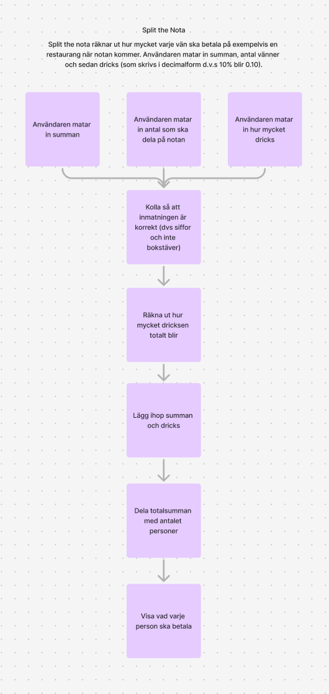

# Individuell inlämningsuppgift: Pseudokod
## Instruktioner
Du ska i denna inlämningsuppgift skriva pseudokod för nedanstående problem. Om du vill kan du använda dig av de keywords som finns i detta [cheat sheet](https://gist.github.com/zocom-christoffer-wallenberg/dbb443c26407cfec308f9578ccf9845a).

Det finns två problem, ett för **G** och ett för **VG**. För att få **VG** ska du göra **både** G och VG-nivån. Du får alltså inte VG för att bara skriva pseudokod för VG-nivån.

All "kodning" skall göras inom anvisade block i filen script.js. Där finns även förslag på startkod. Denna är frivillig att använda, och vill man istället skriva helt egen pseudokod från "scratch" så är detta tillåtet.

## G-nivå - Split the nota
Split the nota räknar ut hur mycket varje vän ska betala på exempelvis en restaurang när notan kommer. Användaren matar in summan, antal vänner och sedan dricks **(som skrivs i decimalform d.v.s 10% blir 0.10)**. Skisserna nedan är mest för att ge visuell bild av hur det ser ut, ni behöver inte ha med sådant som "byt vy" eller liknande i er pseudokod.

### Räkna ut

**Visa summa**

## VG-nivå - Lewis Carroll Word Puzzle
I denna övning så ska du skapa ett spel baserat på ett ordpussel skapat av Lewis Carroll.

### Vad
Lewis Carroll är förmodligen mest känd som författaren bakom Alice i underlandet men han var även matematiker och hade en förkärlek för ordlekar, logik och fantasi. Läser du Alice i underlandet speciellt på engelska går det att se att boken är fylld av just detta. Nedan är ett exempel:

> “Take some more tea,” the March Hare said to Alice, very earnestly.

> “I’ve had nothing yet,” Alice replied in an offended tone: “so I can’t take more.”

> “You mean you can’t take less,” said the Hatter: “It’s very easy to take more than nothing.”

Han tyckte även om att skapa olika typer av pussel både rena logikpussel men pussel som leker med orden. Ett av hans mesta kända pussel heter Doublets som du kommer få göra i denna övning.

### Instruktioner
Pusslet går ut på att du får ett startord och ett slutord och du ska genom att byta ut bokstäver i ditt startord få det till ditt slutord med så få byten som möjligt.

#### Regler

- Du får enbart byta ut en bokstav åt gången.
- Varje ord som bildas måste vara ett korrekt engelskt ord, dvs. det måste finnas i variabeln vid namn ordbok.

#### Exempel

I detta exempel så ska vi få FOUR att bli FIVE. Observera att själva spelet är på engelska.

- FOUR (startord)
- FOUL (Bytte ut R till L)
- FOOL (Bytte ut U till O)
- FOOT (Bytte ut L till T)
- FORT (Bytte ut O till R)
- FORE (Bytte ut T till E)
- FIRE (Bytte ut O till I)
- FIVE (Slutord)

#### Hur
Börja med att testa pusslet med papper och penna gör ett pussel så du förstår hur det fungerar. Skriva varje nytt ord under det förgående ordet som jag har gjort ovan och håll dig till reglerna.

Testa med detta pussel:

EYE (startord)

LID (Slutord)

Därefter går du över till att skriva pseudokod för pusslet.

#### Tänk på!
Din pseudokod måste innefatta kontroller som kontrollerar användarens input. Användaren får inte:

- Ange ett ord som inte inkluderas i varaibeln ordbok.
- Ändra fler eller färre bokstäver än 1 per runda. (Koden för detta MÅSTE abstraheras i en separat funktion)

## Krav
**För Godkänt måste du:**

- Göra G-uppgiften
- Skapa ett flödesdiagram över processen
- Skapa pseudokod som skulle fungera

**För Väl Godkänt måste du:**

- Göra G- och VG-uppgiften
- Skapa ett flödesdiagram över processerna
- Skapa pseudokod som skulle fungera för båda programmen

## Inlämning
Uppladdning av ditt repo på Github senast **20/12 23:59!** Ta en printscreen över ditt / dina flödesdiagram och klistra in i readme-filen i ditt repo.

## Flödesdiagram

# Split the Nota

# Lewis Carroll Word Puzzle

